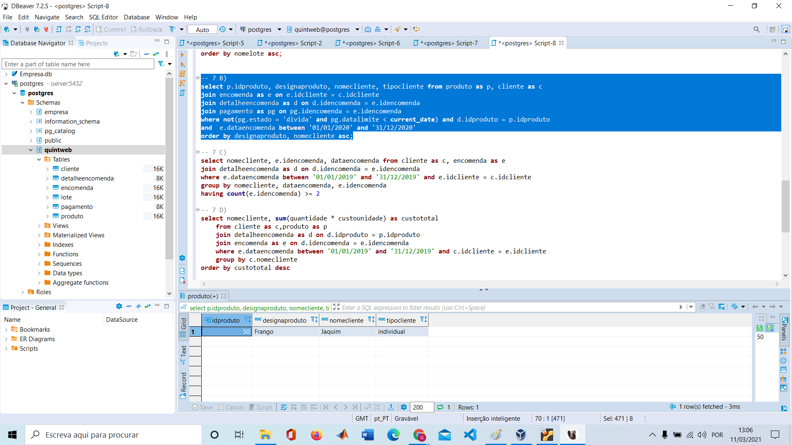

# :seedling: QuintWeb
<h1 align="center">
      
</h1>

 

## :page_with_curl: About

This work was carried out during the course of Information Systems at ISEL institute. Starting from a problem domain, in this case called "QuintWeb" in which a farmer wants to systemize his work. To achieve what is proposed in this work, we began the formulation of the Entity-Association Model, subsequently it's Relationaship Model to further more use the SQL language and a database created in PostgreSQL.

## 🧪 Softwares

This project was developed using the following softwares:
- Dia: Open source drawing software.
- Dbeaver: Free multi-platform database tool for developers, SQL programmers, database administrators and analysts.

## :computer: Technologies

This project was developed using the following technologies:

- SQL

## License 📝 

This project is under a MIT license. Click <a  href="https://github.com/gustavodev1998/QuintWeb/blob/main/LICENSE"> here </a> to know more

Made with :heart: by <strong>Gustavo Campos</strong>

